#   

"_Estou me afastando de tudo que me atrasa, me engana, me segura e me retém. Estou me aproximando de tudo que me faz completo, me faz feliz e que me quer bem." - (Caio Fernando Abreu)_

* * * 

# Quem sou eu?

_Meu nome é Hildelitan Pereira de Oliveira, tenho 18 anos e sou aluna do Curso Integrado de Jogos Digitais, do IFRN Campus Ceará-mirim._

* * *

# Instituição de Ensino

# 

* * * 

## Em que Empresa atuo?

# 

* * * 

# Quais meus passatempos favoritos?

* _Netflix_  
* _Redes sociais_  
* _Festas_  
* _Praia_  
* _Música_  

* * * 

# Jogos desenvolvidos na Empresa Adeliro Games

# 

* _*Descrição:* Neste jogo, o personagem Lampião tem como objetivo passar de todas as fases para conseguir libertar Maria Bonita do cativeiro dos bandidos, os quais estão impedindo Lampião em seu percurso. Logo, o jogador deverá detê-los para cumprir o objetivo proposto._ 

# [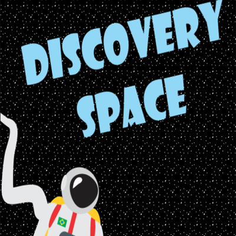](https://alessandrats.github.io/DiscoverySpace/)

* _*Descrição:* Neste jogo, o astronauta precisa coletar partes para concertar uma nave quebrada, como por exemplo, ferramentas, e só assim conseguir destravar as fases seguintes que decorrem, para, ao final, conseguir voltar à Terra em sua nave._  

# [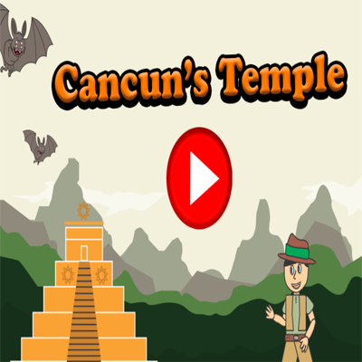](https://alessandrats.github.io/CancunsTemple/)

* _*Descrição:* Neste jogo, o personagem aventureiro George se vê perdido na floresta quando escuta um barulho ameaçador e entra em um templo, o qual pertence à um deus chamado Cancun. Para sair deste templo, ele terá que coletar amuletos para Cancun e mover-se entre inimigos que impedem a sua passagem, como por exemplo, macacos, plantas carnívoras, faunos, entre outros. Com todos os amuletos coletados, George poderá sair da caverna._ 

# [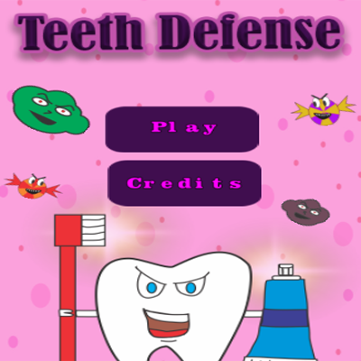](https://alessandrats.github.io/TeethDefense/)

* _*Descrição:* O jogo Teeth Defense traz como objetivo o jogador ter que impedir a chegada de bactérias, cáries e balinhas de mascar à boca, e para isso ele terá que implementar "torres" nos dentes, as quais podem ser: creme dental, fio dental e escova de dente. Caso os inimigos cheguem à boca, ela irá ficando suja até que o jogador perderá a fase e ela será reiniciada. Esse jogo foi desenvolvido com o intuito de fazer com que as pessoas tenham um certo cuidado com a saúde bucal, isto é, com a finalidade de conscientização._    

* * * 

# Algumas artes desenvolvidas na Empresa Adeliro Games

## O Rei do Cangaço

#   

## Discovery Space

#   

#   

## Cancun's Temple

#   

# 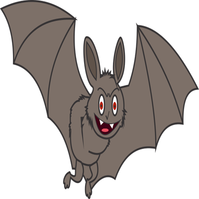  

# 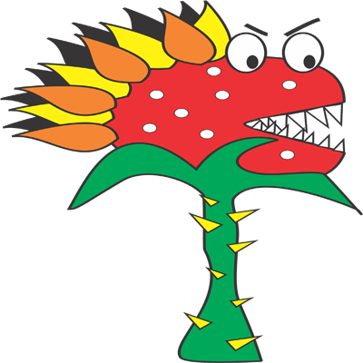  

# 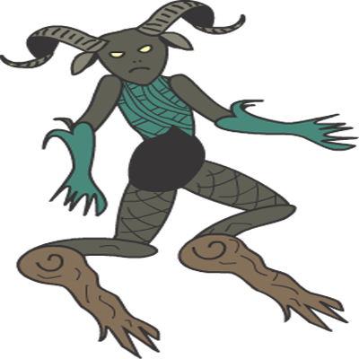  

## Teeth Defense

# 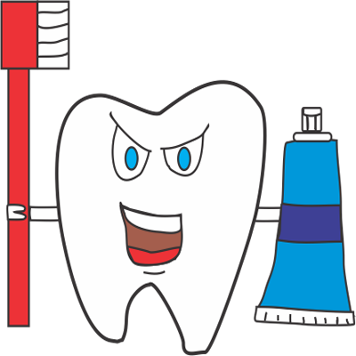  

# 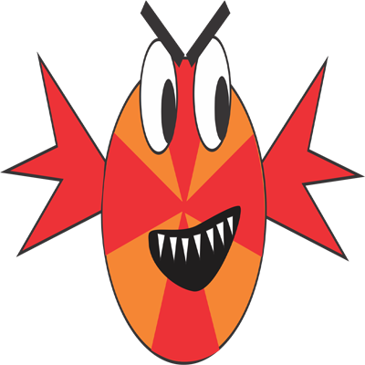  

#   

# 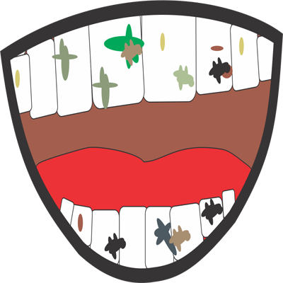  

# 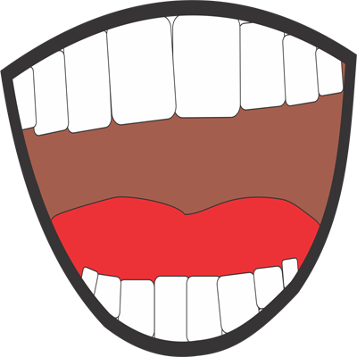  

* * *

# Influence Map 

# 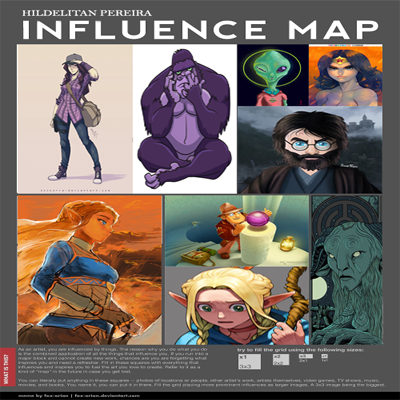  

* * *
# Projetos

* _Projeto English Club_  
* _CIA Musical Tiê_  
* _TCC (em início de desenvolvimento): Desenvolver um jogo que auxilie crianças com TDAH na fase da aprendizagem escolar. 

* * *

# Grade curricular

_Atualmente assistindo aulas em disciplinas voltadas para o desenvolvimento de Jogos Digitais no IFRN Campus Ceará-mirim_. 

* * *

# Trabalhos acadêmicos

* _Remake da música Photograph: [Remake Photograph - Ed Sheeran](https://www.youtube.com/watch?v=gk6JF1bzlB8)_  
* _Fotografias para a música Where have you been: [Célula coreográfica](https://www.youtube.com/watch?v=0XH5Oab4L-Y)_  
* _O Rei Arthur e a Távola Redonda: [O Rei Arthur e a Távola Redonda](https://www.youtube.com/watch?v=RSX8255Pq-Y)_

# Redes Sociais 

* _Instagram:  [hildelitanx](https://www.instagram.com/hildelitanx/)_    
* _Twitter: [tomlixxsonz](https://twitter.com/tomlixxsonz)_  
* _Tumblr:  [in-inversos](http://in-inversos.tumblr.com/)_    
* _Facebook:  [Hildelitan Pereira](https://www.facebook.com/hildelitan)_    
* _Currículo Lattes: [Hildelitan Pereira de Oliveira](http://lattes.cnpq.br/5361936635040520)_  
* _E-mail: hildelitanpereira@outlook.com_
