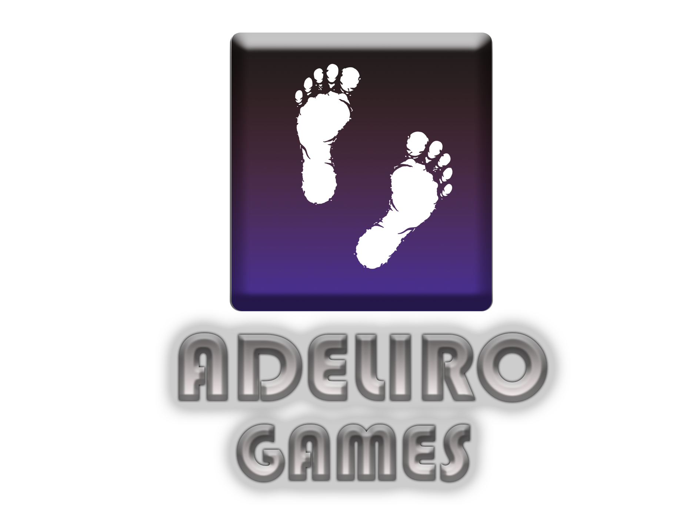

# Quem sou eu

_Aluna do Curso Integrado Jogos Digitais, do IFRN Campus Ceará-mirim, aprendendo a fazer um portfólio com o prof. Marcelo_.

* * *

## Empresa em que atuo

[]

# Portfólio

* * *

## Games

[TEXTO QUE VAI APARECER](LINK)

* * *

## Artes

* * *

## Projetos

* _Proj. de Jogos_
* _Proj. de Música_
* _Proj. de Assets_

* * *

### Aulas

_Atualmente assistindo aulas em disciplinas voltadas para o desenvolvimento de Jogos Digitais no IFRN Campus Ceará-mirim_. 

* * *

** negrito  
_ itálico  
~~ riscado  
3* linha horizontal (barra)

hashtahs uma ou mais hashtags criam capítulos ou subcapítulos  
asteriscos criam listas não ordenadas  
1,2,3 criam listas ordenadas  

* * *
